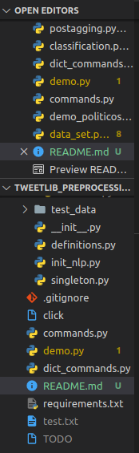

# Experimentos
## Preprocesing

3 experimentos para preprocessing (POS, BIGRAM)

Evaluar el preprocesamiento para los diferentes dataset y Count_Tweet_x_DataSet: 1000:

### Exp 1: POS
1. Config:
        #Preprocessing: BASIC(Sin Preprocesing), TOKENIZE, SINTAX(token_stopword_lowercase_lemma), ARTIFACT(emoji_link_num_punct), RM_ALPHA_NUM(rm_alphanumeric)
        #Encoding: POS
        #Classifier: SVM
        #Tagging: SPACY
2. DataSet: Politicos(10), Deportistas(10), Artistas(10), Youtubers(10) y Todos(40)
3. Count_Tweet_x_DataSet: 1000

### Exp 2: BIGRAM
1. Config:
        #Preprocessing: BASIC(Sin Preprocesing), TOKENIZE, SINTAX(token_stopword_lowercase_lemma), ARTIFACT(emoji_link_num_punct), RM_ALPHA_NUM(rm_alphanumeric)
        #Encoding: BIGRAM
        #Classifier: SVM
        #Tagging: SPACY
2. DataSet: Politicos(10), Deportistas(10), Artistas(10), Youtubers(10) y Todos(40)
3. Count_Tweet_x_DataSet: 1000

#### Qué preprocessing es el más adecuado para cada encoding...

## Library (SPACY vs STANZA)

Evaluar las Librerias para los diferentes dataset y Count_Tweet_x_DataSet: 1000:

### Exp 1: SPACY vs STANZA

1. Config:
        #Preprocessing: TOKENIZE
        #Encoding: POS
        #Classifier: SVM
        #Tagging: SPACY, STANZA
2. DataSet: Politicos(10), Deportistas(10), Artistas(10), Youtubers(10) y Todos(40)
3. Count_Tweet_x_DataSet: 1000

<!-- ### Exp 2: STANZA

1. Config:
        #Preprocessing: TOKENIZE
        #Encoding: POS
        #Classifier: SVM
        #Tagging: STANZA
2. DataSet: Politicos(10), Deportistas(10), Artistas(10), Youtubers(10) y Todos(40)
3. Count_Tweet_x_DataSet: 1000 -->

#### Qué Library es la más adecuada para el encoding de POS...

## Classifier

Evaluar el encoding para los diferentes dataset y Count_Tweet_x_DataSet: 1000:

### Exp 1: SVM vs BAYES vs LOGISTIC REGRESSION

1. Config:
        #Preprocessing: TOKENIZE
        #Encoding: POS
        #Classifier: SVM, BAYES, LOGISTIC REGRESSION
        #Tagging: SPACY
2. DataSet: Politicos(10), Deportistas(10), Artistas(10), Youtubers(10) y Todos(40)
3. Count_Tweet_x_DataSet: 1000

<!-- ### Exp 2: BAYES

1. Config:
        #Preprocessing: TOKENIZE
        #Encoding: POS
        #Classifier: BAYES
        #Tagging: SPACY
2. DataSet: Politicos(10), Deportistas(10), Artistas(10), Youtubers(10) y Todos(40)
3. Count_Tweet_x_DataSet: 1000

### Exp 3: LOGISTIC REGRESSION

1. Config:
        #Preprocessing: TOKENIZE
        #Encoding: POS
        #Classifier: LOGISTIC REGRESSION
        #Tagging: SPACY
2. DataSet: Politicos(10), Deportistas(10), Artistas(10), Youtubers(10) y Todos(40)
3. Count_Tweet_x_DataSet: 1000 -->
#### Cuál es el Classifier con mejor resultado. (Accuracy) ...

## Encoding

Evaluar los Encoding para los diferentes dataset y Count_Tweet_x_DataSet: 1000:
### Exp 1: POS vs BIGRAM
1. Config:
        #Preprocessing: TOKENIZE
        #Encoding: POS, BIGRAM
        #Classifier: SVM
        #Tagging: SPACY
2. DataSet: Politicos(10), Deportistas(10), Artistas(10), Youtubers(10) y Todos(40)
3. Count_Tweet_x_DataSet: 1000

<!-- ### Exp 2: BIGRAM
1. Config:
        #Preprocessing: TOKENIZE
        #Encoding: BIGRAM
        #Classifier: SVM
        #Tagging: SPACY
2. DataSet: Politicos(10), Deportistas(10), Artistas(10), Youtubers(10) y Todos(40)
3. Count_Tweet_x_DataSet: 1000 -->

#### Qué Encoding da mejor resultado. Y los dataset que más aporten al encoding. Podemos sacar conclusiones con los diferentes dataset, ejemplo a los politicos otros pueden escribir sus tweets, por lo que quizas no den mejores resultados como los youtubers..

## Variedad en cantidad de tweets por usuario, usando DataSet: Todos (40)

### Exp 1: POS, BIGRAM
1. Config:
        #Preprocessing: TOKENIZE
        #Encoding: POS
        #Classifier: SVM
        #Tagging: SPACY
2. DataSet: Todos(40)
3. Count_Tweet_x_DataSet: 50, 100, 200, 500, 1000
<!-- 
### Exp 2: BIGRAM
1. Config:
        #Preprocessing: TOKENIZE
        #Encoding: BIGRAM
        #Classifier: SVM
        #Tagging: SPACY
2. DataSet: Todos(40)
3. Count_Tweet_x_DataSet: 50, 100, 200, 500, 1000 -->

#### Cómo varian los resultados del Encoding con respecto a la cantidad de tweets por usuario. 


Evaluar Mejor preprocessing (TOKENIZE), Encoding (BIG), Clasificador tradicional (SVM) vs BERT (Deep Learning) Preprocessing (Basic). Para los diferentes dataset y Count_Tweet_x_DataSet: 1000:
### Exp 1: SVM

1. Config:
        #Preprocessing: TOKENIZE
        #Encoding: BIGRAM
        #Classifier: SVM
        #Tagging: SPACY
2. DataSet: Politicos(10), Deportistas(10), Artistas(10), Youtubers(10) y Todos(40)
3. Count_Tweet_x_DataSet: 1000

### Exp 2: BERT

1. Config:
        #Preprocessing: BASIC
        #Encoding: BERT
        #Classifier: BERT
        #Tagging: -
2. DataSet: Politicos(10), Deportistas(10), Artistas(10), Youtubers(10) y Todos(40)
3. Count_Tweet_x_DataSet: 1000

#### Cuál es el la metodología con mejor resultado (Accuracy) Marching learnin vs Deep Learning ...


## Preprocessing para BERT
### Exp 3: BERT
1. Config:
        #Preprocessing: BASIC(Sin Preprocesing), TOKENIZE, SINTAX(token_stopword_lowercase_lemma), ARTIFACT(emoji_link_num_punct), RM_ALPHA_NUM(rm_alphanumeric)
        #Encoding: BERT
        #Classifier: BERT
        #Tagging: Si es BASIC no tiene tagging '-' de lo contrario 'SPACY'
2. DataSet: Politicos, Deportistas, Artistas, Youtubers y Todos
3. Count_Tweet_x_DataSet: 1000

#### BERT le viene bien algún preprocessing extra?...

-----------------------------------------------------------------------------------------------------
# Ejemplos de comando para cada caso de uso:

## Descarga de todos los tweets de todos los usuario.

## Descarga de todos los tweets por usuario especificado.

## Eliminar usuarios.

## Agregar un texto a la DB de un usuario determinado.

## Validar el Modelo

### Example 1:

Explicacion de los q se hace
```console
$ python commands.py validate-model -p TOKENIZE -e POS -c SVM -nlp SPACY -ds politico
```

### Ej mascual

Explicacion de los q se hace
```console
$ python commands.py validate-model -p TOKENIZE -e POS -c SVM -nlp SPACY -ds politico
```



## Crear el Modelo

## Actualizar el Modelo

## Predecir (Encontrar el autor)

